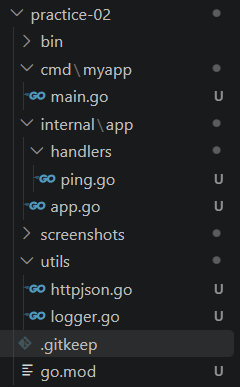
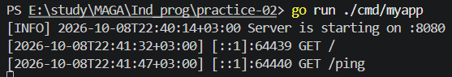
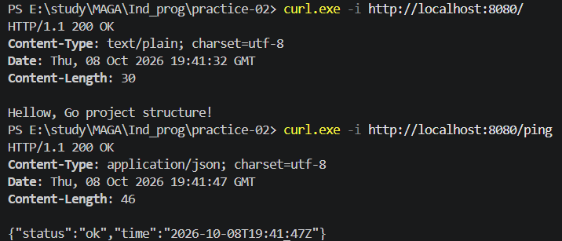
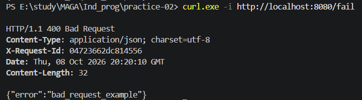

# Практическая работа 2
## Боровская В.В. ЭФМО-01-26

HTTP-сервис на Go, демонстрирующий разделение проекта на точку входа `cmd/myapp`, приложение `internal/app`, обработчики `internal/app/handlers` и вспомогательные функции `utils`. Реализованы маршруты `/`, `/ping` и `/fail`, логирование запросов и передача `X-Request-Id`.

Для запуска перейдите в `practice-02` и выполните `go run ./cmd/myapp`. Сервер слушает порт `8080`; перед запуском остановите другие приложения, использующие этот порт. Для остановки нажмите `Ctrl+C`.

## Структура

```text
practice-02/
├── cmd/myapp/main.go
├── internal/app/
│   ├── app.go
│   └── handlers/ping.go
├── utils/
│   ├── logger.go
│   └── httpjson.go
├── screenshots/
├── go.mod
└── README.md
```

`main.go` вызывает `app.Run()`. Приложение регистрирует маршруты и оборачивает роутер middleware для Request-ID. Пакет `utils` содержит логирование, генерацию идентификатора и функции JSON-ответов. Внешних зависимостей нет, поэтому `go.sum` не требуется.

## Проверка

Выполните во втором терминале при работающем сервере:

```powershell
curl.exe -i http://localhost:8080/
curl.exe -i http://localhost:8080/ping
curl.exe -i -H "X-Request-Id: demo-123" http://localhost:8080/ping
curl.exe -i http://localhost:8080/fail
```

| Маршрут | Статус | Ответ |
|---|---|---|
| `/` | 200 | Текстовое приветствие |
| `/ping` | 200 | JSON с `status: "ok"` и текущим временем UTC в RFC3339 |
| `/fail` | 400 | `{"error":"bad_request_example"}` |

При передаче `X-Request-Id` сервер возвращает его значение в ответе; иначе генерирует идентификатор из 16 шестнадцатеричных символов. Лог запроса содержит время, адрес клиента, метод и путь. Request-ID в лог пока не включён.

## Сборка и проверка кода

Команды выполняются из `practice-02`:

```powershell
go fmt ./...
go vet ./...
go build -o bin/myapp.exe ./cmd/myapp
.\bin\myapp.exe
```

В корневой папке репозитория файл `.vscode/tasks.json` содержит задачи «ПЗ2: запуск» и «ПЗ2: сборка». Они рассчитаны на открытие всей папки `Ind_prog` в VS Code.

## Размещение артефактов

1. Точку входа приложения я размещаю в `cmd/myapp/main.go`. Это позволяет оставить запуск коротким и отделить его от реализации сервера.
2. Обработчик `/ping` я размещаю в `internal/app/handlers/ping.go`. Он относится к внутреннему коду приложения и не предназначен для использования сторонними проектами.
3. Описание HTTP API в формате OpenAPI я разместила бы в `api/openapi.yaml`. Контракт удобно хранить отдельно от обработчиков, чтобы использовать его для документации и согласования API.
4. Пример настроек приложения я разместила бы в `configs/example.yaml`. Такой файл показывает доступные параметры и не должен содержать реальные пароли или токены.
5. Скрипт сборки я разместила бы в `scripts/build.ps1`. Он позволяет повторять сборку одной командой и хранить её шаги вместе с проектом.

## Скриншоты

### Структура проекта



### Запуск и логи



### Ответ ping



### Ответ fail


