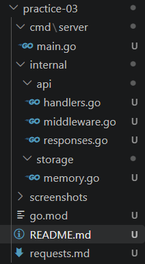
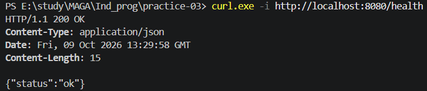
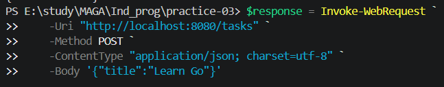
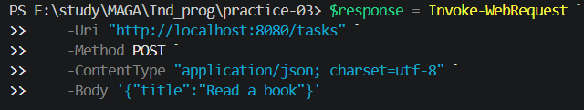
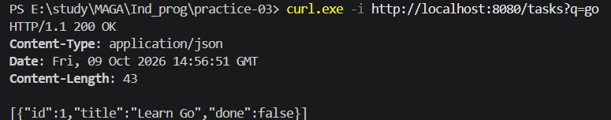
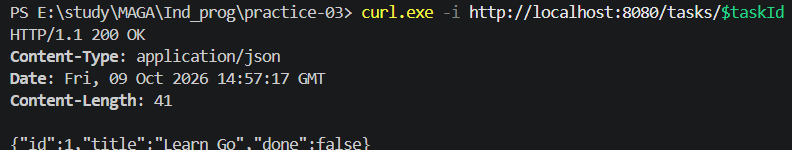
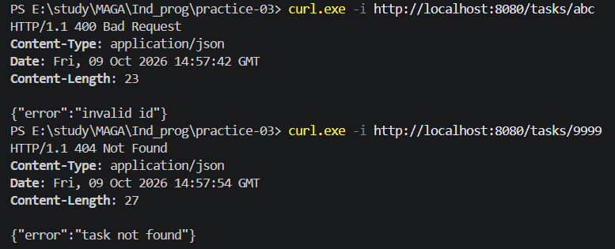
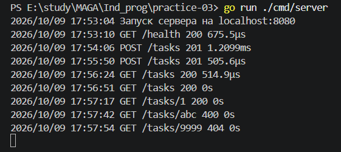

# Практическая работа 3
## Боровская В.В. ЭФМО-01-26

HTTP API для задач на стандартной библиотеке Go `net/http`. 
Реализовано:
- создание задачи
- получение списка с поиском по названию
- получение задачи по ID
- проверка состояния сервера

Ответы и ошибки формируются в JSON, middleware записывает метод, путь, статус и длительность обработки запроса.

Данные хранятся в памяти и удаляются после остановки приложения. Доступ к хранилищу защищён `sync.RWMutex`.

## Структура проекта

```text
practice-03/
├── cmd/server/main.go
├── internal/
│   ├── api/
│   │   ├── handlers.go
│   │   ├── middleware.go
│   │   └── responses.go
│   └── storage/memory.go
├── screenshots/
├── go.mod
├── requests.md
└── README.md
```

`cmd/server` связывает компоненты и запускает сервер. Пакет `api` содержит обработчики, JSON-ответы и middleware, а `storage` отвечает за хранение задач и выдачу идентификаторов. Имя модуля в текущем `go.mod` содержит `pracrice-03`.

## Запуск

Из корня репозитория:

```powershell
cd practice-03
go run ./cmd/server
```

Сервер по умолчанию доступен по адресу `http://localhost:8080` только с текущего компьютера. Для остановки нажмите `Ctrl+C`. Если порт занят сервером другой практики, остановите его или выберите другой порт.

## Настройка порта

Значение `PORT` читается при запуске. Если переменная отсутствует или пуста, используется `8080`.

```powershell
$env:PORT = "8081"
go run ./cmd/server
```

Проверка во втором терминале:

```powershell
curl.exe -i http://localhost:8081/health
```

Для возврата к стандартному порту остановите сервер и в терминале, где задавали переменную, выполните:

```powershell
Remove-Item Env:PORT 
go run ./cmd/server
```

## Маршруты

| Метод и путь | Назначение | Успешный статус |
|---|---|---|
| `GET /health` | Состояние сервера | 200 |
| `GET /tasks` | Список задач | 200 |
| `GET /tasks?q=go` | Поиск по части названия без учёта регистра | 200 |
| `POST /tasks` | Создание задачи | 201 |
| `GET /tasks/{id}` | Получение задачи по ID | 200 |

Пример создания задачи в PowerShell:

```powershell
'{"title":"Learn Go"}' | curl.exe -i -X POST http://localhost:8080/tasks -H "Content-Type: application/json" --data-binary '@-'
```

Пример ответа:

```json
{"id":1,"title":"Learn Go","done":false}
```

ID увеличивается при создании задач. Порядок элементов списка не гарантируется. Изменение поля `done` и удаление задач в этой работе не реализованы.

## Ошибки

Ошибки имеют формат `{"error":"сообщение"}` и заголовок `Content-Type: application/json`.

| Ситуация | Статус | Сообщение |
|---|---|---|
| Некорректный JSON | 400 | `invalid JSON` |
| Пустое название или только пробелы | 400 | `title is required` |
| Переданный Content-Type отличается от application/json | 400 | `Content-Type must be application/json` |
| Некорректный или неположительный ID | 400 | `invalid id` |
| Задача отсутствует | 404 | `task not found` |

При отсутствии Content-Type текущая реализация пытается прочитать JSON. Проверки длины названия, PATCH, DELETE и CORS из дополнительного пункта 8 не выполнялись.

## Проверка и сборка

Из папки `practice-03`:

```powershell
go fmt ./...
go vet ./...
go build -o bin/server.exe ./cmd/server
.\bin\server.exe
```

Перед запуском собранного приложения остановите предыдущий экземпляр на том же порту. После изменения кода бинарник нужно пересобрать; изменение `PORT` повторной сборки не требует.

Восемь запросов для ручной проверки и ожидаемые ответы находятся в [requests.md](requests.md). Запросы следует выполнять последовательно, не перезапуская сервер между созданием и чтением задач.

## Скриншоты

### Структура проекта



### Проверка состояния



### Создание задач





### Список и фильтрация



### Получение задачи по ID



### Ошибки



### Логи сервера

